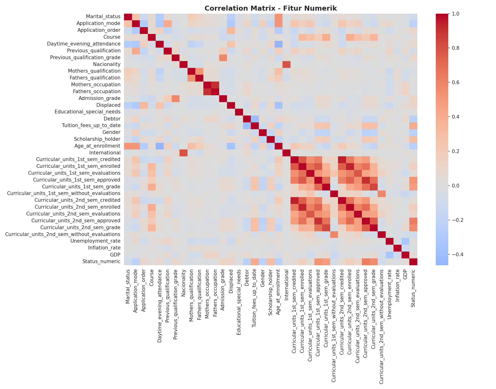
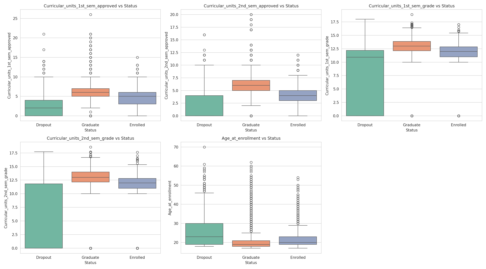
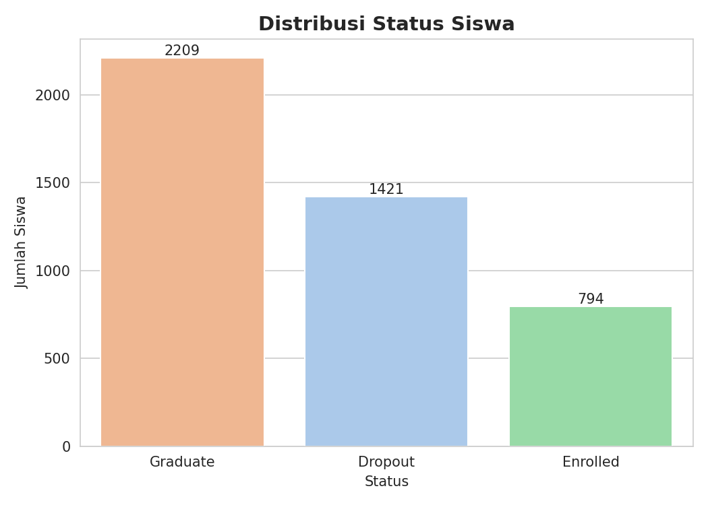
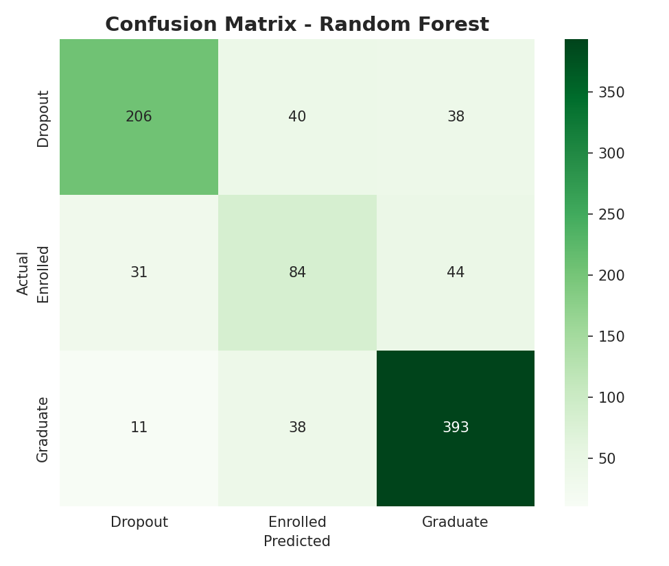
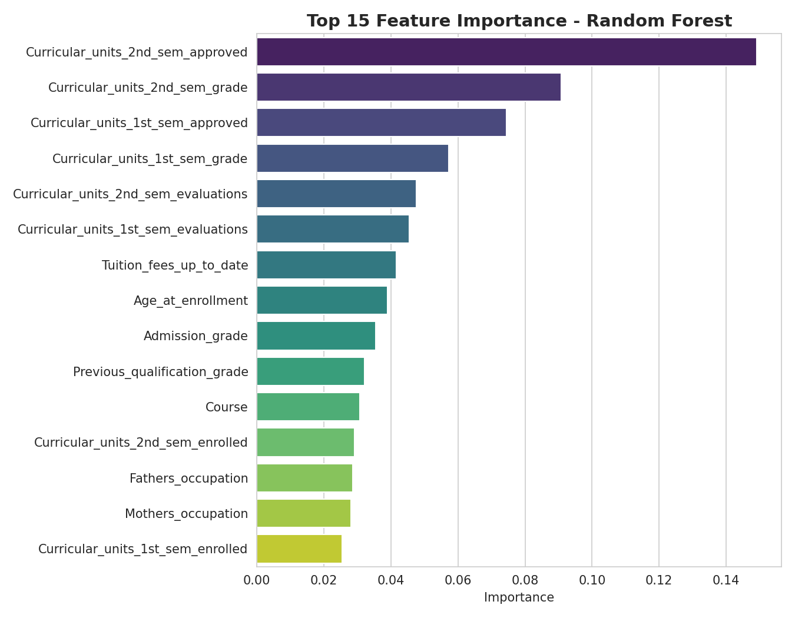

# Proyek Akhir: Menyelesaikan Permasalahan Institusi Pendidikan

- Nama: Muhammad Arfani Asra
- Email: arfani152@gmail.com
- Id Dicoding: arfaniasra

## Business Understanding

Jaya Jaya Institut merupakan salah satu institusi pendidikan perguruan tinggi yang telah berdiri sejak tahun 2000 dan telah mencetak banyak lulusan dengan reputasi baik. Namun, institusi ini menghadapi masalah besar berupa tingginya angka siswa yang tidak menyelesaikan pendidikannya (dropout).

Untuk mengatasi hal ini, Jaya Jaya Institut ingin dapat mendeteksi secepat mungkin siswa yang berpotensi melakukan dropout, sehingga dapat diberikan bimbingan khusus sebelum terlambat.

### Permasalahan Bisnis

1. Tingginya jumlah siswa yang dropout menjadi masalah signifikan bagi reputasi dan keberlanjutan institusi.
2. Institusi belum memiliki sistem yang dapat mengidentifikasi secara dini siswa-siswa yang berisiko dropout.
3. Institusi memerlukan media monitoring yang mudah dipahami untuk memantau performa siswa secara berkala.

### Cakupan Proyek

1. Melakukan analisis data siswa (demografis, sosial-ekonomi, dan akademik) untuk memahami faktor-faktor yang berkaitan dengan dropout.
2. Membangun model machine learning untuk memprediksi status siswa (Dropout, Enrolled, atau Graduate).
3. Membuat dashboard visualisasi untuk membantu pihak institusi memonitor performa siswa.
4. Membuat prototype aplikasi berbasis Streamlit agar model dapat digunakan secara praktis oleh pihak institusi.
5. Memberikan rekomendasi action items berdasarkan hasil analisis.

### Persiapan

Sumber data: [Students' Performance Dataset](https://github.com/dicodingacademy/dicoding_dataset/blob/main/students_performance/README.md)

Setup environment:
```bash
python -m venv venv
source venv/bin/activate   # Windows: venv\Scripts\activate
pip install -r requirements.txt
```

Menjalankan notebook:
```bash
jupyter notebook notebook.ipynb
```

## Exploratory Data Analysis (EDA)

Sebelum membangun model dan dashboard, dilakukan eksplorasi data untuk memahami pola dan hubungan antar fitur terhadap status kelulusan siswa. Analisis lengkap dapat dilihat pada `notebook.ipynb`, berikut beberapa temuan utamanya:



Correlation heatmap di atas menunjukkan bahwa fitur-fitur performa akademik semester 1 dan 2 (jumlah mata kuliah credited, enrolled, evaluated, approved, dan grade) saling berkorelasi kuat satu sama lain, dan juga berkorelasi cukup kuat terhadap status kelulusan siswa.



Boxplot di atas memperlihatkan pola yang jelas: siswa dengan status Dropout secara konsisten memiliki median jumlah mata kuliah yang disetujui (approved) mendekati 0-2, jauh lebih rendah dibanding siswa Graduate (5-7), baik di semester 1 maupun 2. Usia saat mendaftar juga terlihat lebih tinggi dan lebih tersebar pada kelompok Dropout dibanding Graduate.

## Business Dashboard

Dashboard dibuat menggunakan **Metabase** untuk membantu Jaya Jaya Institut memonitor performa siswa. Dashboard ini menampilkan:

1. Distribusi status siswa (Dropout, Enrolled, Graduate)
2. Rata-rata jumlah mata kuliah yang disetujui per status (indikator performa akademik)
3. Perbandingan status siswa berdasarkan kepemilikan beasiswa
4. Perbandingan status siswa berdasarkan status pembayaran SPP
5. Rata-rata usia saat mendaftar per status
6. Jumlah siswa per program studi

Screenshot dashboard dapat dilihat pada folder `arfaniasra_dicoding-dashboard/`, dan juga ditampilkan di bawah ini:


**Cara menjalankan dashboard secara lokal:**

1. Jalankan Metabase melalui Docker:
   ```bash
   docker run -d -p 3000:3000 --name metabase metabase/metabase
   ```
2. Copy file `metabase.db.mv.db` yang ada di folder submission ini ke dalam container:
   ```bash
   docker cp metabase.db.mv.db metabase:/metabase.db/metabase.db.mv.db
   docker restart metabase
   ```
3. Akses dashboard melalui browser: `http://localhost:3000`
4. Login menggunakan kredensial berikut:
   - **Email**: `root@mail.com`
   - **Password**: `root123`

## Menjalankan Sistem Machine Learning

Prototype sistem machine learning dibuat menggunakan **Streamlit** dan telah di-deploy ke **Streamlit Community Cloud**, sehingga dapat diakses secara online tanpa perlu instalasi apapun.

**Akses online:**
🔗 https://arfaniasra-dropout-prediction.streamlit.app

**Menjalankan secara lokal:**

```bash
python -m venv venv
source venv/bin/activate   # Windows: venv\Scripts\activate
pip install -r requirements.txt
streamlit run app.py
```

Setelah dijalankan, aplikasi dapat diakses melalui browser di `http://localhost:8501`. Isi data siswa pada form yang tersedia (terbagi dalam 4 tab: Demografis, Finansial, Akademik Awal, dan Performa Semester), lalu klik tombol **"Prediksi Status Siswa"** untuk mendapatkan hasil prediksi beserta probabilitasnya.

## Conclusion

Proyek ini bertujuan membantu Jaya Jaya Institut mendeteksi siswa yang berisiko dropout sejak dini, sehingga dapat diberikan bimbingan khusus sebelum terlambat.



Dari 4.424 data siswa, distribusinya adalah 49,9% Graduate, 32,1% Dropout, dan 17,9% Enrolled — menunjukkan bahwa hampir sepertiga siswa mengalami dropout, sehingga masalah ini memang signifikan dan perlu ditangani.

Berdasarkan hasil analisis dan pemodelan yang telah dilakukan, dapat disimpulkan:

1. **Model prediksi**: Random Forest berhasil membangun model klasifikasi 3 kelas (Dropout/Enrolled/Graduate) dengan akurasi 77%, dan mampu mengidentifikasi siswa berisiko dropout dengan cukup baik (F1-score 0.77 untuk kelas Dropout).

2. **Faktor akademik semester awal adalah prediktor terkuat.** Jumlah mata kuliah yang berhasil disetujui (approved) dan nilai rata-rata pada semester 1 dan 2 memiliki korelasi tertinggi terhadap status siswa. Siswa yang kesulitan menyelesaikan mata kuliahnya di awal masa studi menunjukkan risiko dropout yang jauh lebih tinggi.

3. **Faktor finansial berperan signifikan.** Status pembayaran SPP yang tidak up-to-date dan status sebagai debtor sangat berkaitan dengan dropout, sementara kepemilikan beasiswa cenderung protektif terhadap dropout.

4. **Faktor demografis turut berkontribusi**, khususnya usia saat pendaftaran — siswa yang mendaftar pada usia lebih tua menunjukkan kecenderungan dropout yang lebih tinggi dibanding siswa yang lebih muda.



Confusion matrix di atas menunjukkan bahwa model paling akurat mengklasifikasikan kelas Graduate dan Dropout, sementara kelas Enrolled paling sering tertukar dengan Graduate — hal ini wajar karena secara konsep, siswa yang "Enrolled" masih aktif dan belum pasti arah kelulusannya.



Grafik feature importance di atas mengonfirmasi bahwa jumlah mata kuliah yang disetujui (approved) dan nilai rata-rata pada semester 1 dan 2 adalah fitur paling berpengaruh terhadap prediksi model, sejalan dengan temuan pada tahap EDA.

Dengan model dan dashboard monitoring ini, Jaya Jaya Institut memiliki dasar kuat untuk melakukan intervensi dini kepada siswa yang teridentifikasi berisiko tinggi dropout, alih-alih menunggu hingga siswa benar-benar keluar dari program studi.

### Rekomendasi Action Items

Berdasarkan hasil analisis di atas, berikut rekomendasi action items untuk Jaya Jaya Institut:

1. **Monitoring performa akademik semester 1 secara aktif.** Bangun sistem *early warning* yang memantau jumlah mata kuliah yang disetujui setiap siswa pada akhir semester 1 — siswa dengan jumlah approved yang rendah harus segera masuk daftar prioritas bimbingan akademik.

2. **Program bimbingan khusus untuk siswa dengan tunggakan SPP.** Karena status pembayaran SPP sangat berkorelasi dengan dropout, sebaiknya institusi menyediakan opsi keringanan/cicilan pembayaran serta pendampingan finansial bagi siswa yang menunggak, sebelum mereka memutuskan untuk keluar.

3. **Perluas cakupan beasiswa.** Karena penerima beasiswa terbukti lebih protektif terhadap dropout, pertimbangkan untuk memperluas kriteria penerima beasiswa, khususnya untuk siswa yang menunjukkan performa akademik baik namun memiliki kendala finansial.

4. **Perhatian khusus untuk siswa yang mendaftar di usia lebih tua.** Siswa non-tradisional (usia lebih tua saat mendaftar) berisiko lebih tinggi dropout — pertimbangkan program pendampingan/orientasi khusus yang disesuaikan dengan kebutuhan kelompok ini (misalnya fleksibilitas jadwal).

5. **Manfaatkan dashboard monitoring** yang telah dibuat untuk memantau performa siswa secara berkala (per semester), sehingga pihak akademik dapat mengambil tindakan berbasis data secara proaktif, bukan reaktif setelah siswa dropout.

6. **Gunakan model prediksi sebagai alat bantu, bukan pengganti keputusan manusia.** Prediksi model sebaiknya digunakan sebagai sinyal awal untuk memicu tindak lanjut personal dari dosen wali/konselor akademik, bukan sebagai keputusan otomatis.
